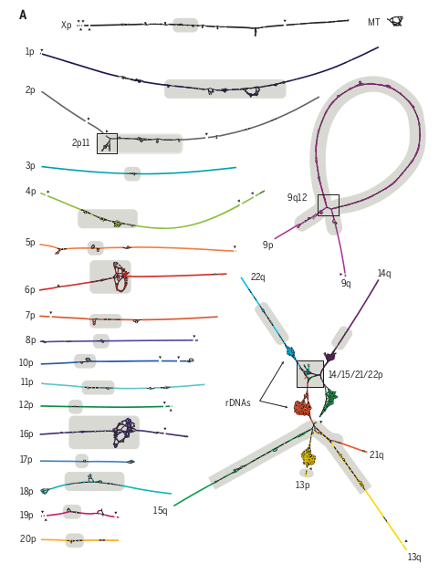

[Back to sections](#tutorial-sections)

### Look at the data and get familiar with them 
The data is stored on the server of the course at this address: 
```bash
/home/genomics/workshop_materials/population_genomics/
```
It consist of genomic data from chromosome 15 for all the samples in the Year1 release of the HPRC. This data is in the Variant Call Format (VCF), a standard file format used in bioinformatics for storing gene sequence variations. More information about the VCF format can be found [here](https://en.wikipedia.org/wiki/Variant_Call_Format). Within the same folder, you will also find the index file for the VCF file with the extension `tbi`


Look at the data, notice the chromosome name **chm13#chr15**:  

```
ll /home/genomics/workshop_materials/population_genomics/chr15.pan.fa.a2fb268.4030258.6a1ecc2.smooth.reliable.vcf.gz

zcat /home/genomics/workshop_materials/population_genomics/chr15.pan.fa.a2fb268.4030258.6a1ecc2.smooth.reliable.vcf.gz | less -S 
```
The name indicates that the vcf that we will use was build using **CHM13 as a reference**, i.e. the genomic coordinates are based on the [sequence of CHM13](https://www.science.org/doi/10.1126/science.abj6987) 

_CHM13 is a human genome reference. It represents a significant advancement in the field of genomics, providing a more complete and accurate representation of the human genome. CHM13 includes regions that were previously difficult to sequence and assemble, making it a valuable resource for a wide range of genetic research. This reference genome helps in better understanding human genetic diversity, disease mechanisms, and evolutionary biology. It is particularly useful in studies where precise genomic information is crucial._

_CHM13 is derived from a hydatidiform mole, which is a rare growth that forms inside the womb at the beginning of a pregnancy. A hydatidiform mole contains a near-complete set of human chromosomes, but with two copies from the father and none from the mother. This unique genetic makeup, with only paternal chromosomes and no maternal contribution, makes it an ideal biological source for sequencing to create a reference human genome. The lack of maternal chromosomes results in a homozygous genetic profile, simplifying the assembly and analysis of the genome. This characteristic of CHM13 has been leveraged to create a more accurate and complete reference human genome._



***
Now look at the metadata, e.g. the information relative to samples, a set of files with info on the geographical origin of the samples in the vcf, take two minute to open the files and look at them: 

```
ll /home/genomics/workshop_materials/population_genomics/pop 
```

### Clone the repository 
While it is possible to access and follow the tutorial directly from the web, having all the code available locally might be better, especially if you intend to run the R scripts. The tutorial is hosted on GitHub, allowing you to clone the entire folder to your local machine for easier access and execution of the scripts. Clone the repository and spend some time navigating the folder to get familiar with the content:  

```
git clone https://github.com/ColonnaLab/tutorials.git

``` 


### Organize your workspace 

Organizing your workspace efficiently is crucial. While you have the flexibility to arrange it according to your preferences, it's recommended to adopt the filesystem structure outlined here. This approach facilitates easier sharing of information and more effective debugging of problems.

Make a folder called popgen within the evomics2024 folder that you just cloned 

`mkdir popgen`

Make subfolders for each session of the tutorial: 

```bash
mkdir 1_afs 
mkdir 2_fst 
mkdir 3.taj 
mkdir 4.pca 
```


### Convert vcf data to plink2 file format  
For certain analyses in this course, we will utilize  [`plink2`](https://www.cog-genomics.org/plink/2.0/), a powerful tool for genetic data analysis. Although `plink2` is capable of reading data directly from VCF files, understanding how to convert VCF files to PLINK format can be useful.

```bash
plink2 --vcf  /home/genomics/workshop_materials/population_genomics/chr15.pan.fa.a2fb268.4030258.6a1ecc2.smooth.reliable.vcf.gz --make-pgen --allow-extra-chr --vcf-half-call m --out chr15 


`--vcf` loads a genotype VCF file

`--make-pgen` creates a new PLINK 2 binary filese

`--allow-extra-chr`  force to accept chromosome code 'chm13#chr15'

`--vcf-half-call` specify how GT half-call should be processed.
The current VCF standard does not specify how '0/.' and similar GT values should be interpreted. By default (mode 'error'/'e'), PLINK errors out and reports the line number of the anomaly. Should the half-call be intentional, though (this can be the case with Complete Genomics data), you can request the following other modes:
'haploid'/'h': Treat half-calls as haploid/homozygous (the PLINK 2 file format does not distinguish between the two) 'missing'/'m': Treat half-calls as missing.

`--out` gives a human-readable name 
```

This command will produce this fileset, all named chr15, but with different file extensions: 
```bash
-rw-rw-r-- 1 enza enza  11108199 gen 13 14:21 chr15.bed
-rw-rw-r-- 1 enza enza  86059365 gen 13 14:21 chr15.bim
-rw-rw-r-- 1 enza enza      1123 gen 13 14:21 chr15.fam
-rw-rw-r-- 1 enza enza       982 gen 13 14:21 chr15.log
-rw-rw-r-- 1 enza enza       718 gen 13 14:21 chr15.nosex
```

Open the chr15.log file and read it to check for error messages if any or just make sure all worked well: 
```bash
cat chr15.log`
```

#### Plink1 and Plink2 
plink is one of the most longeve software for genomic data analysis. 

Latest version plink2 accepts [pfile](https://www.cog-genomics.org/plink/2.0/input#pgen) binary format and suport multiallelic sites

Previous version plink1 accepts [bfile](https://www.cog-genomics.org/plink/2.0/input#bed) binary format 

Take a look at plink [file format](https://www.cog-genomics.org/plink/2.0/formats)

[Back to sections](#tutorialsections)

