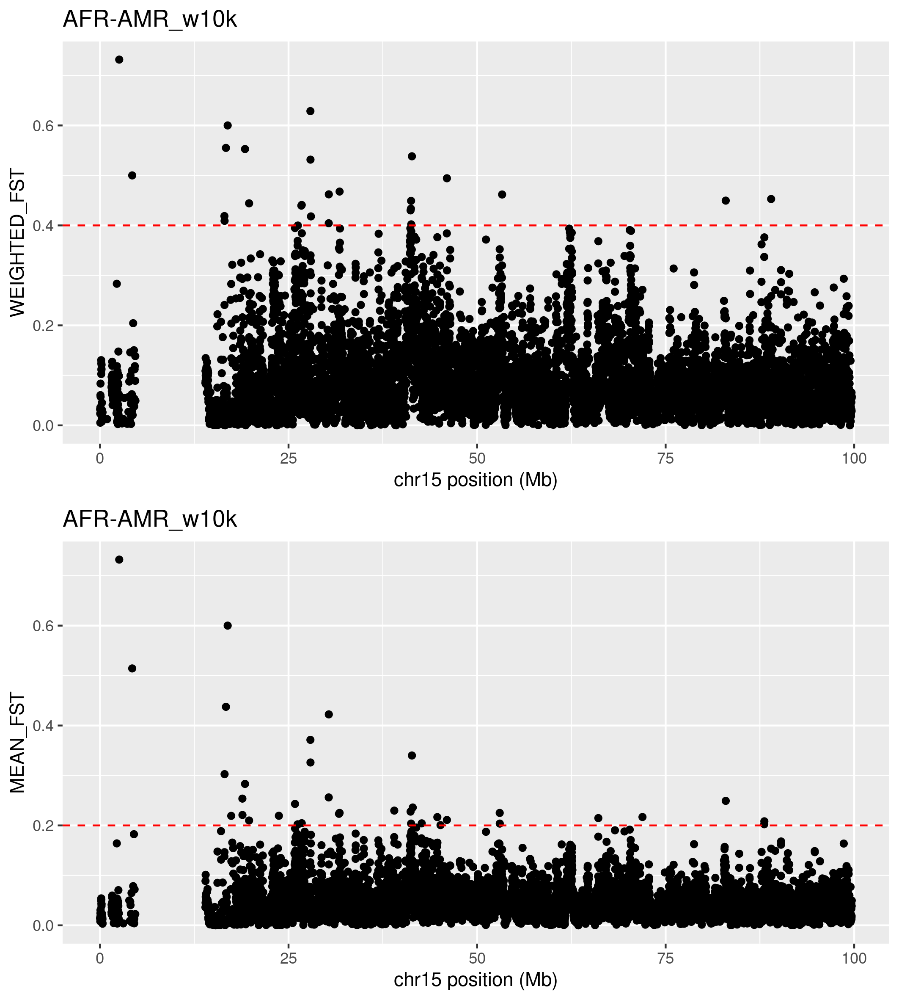
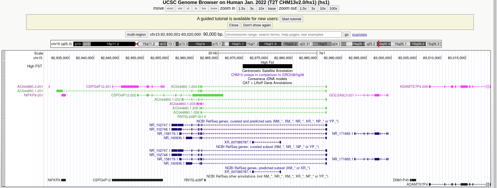

##  Population differentiation 
Fst is a statistical measure that tells us how different two or more groups of people are at the genetic level. It can be calculated for a single locus, over a windowd (average across loci in the window), or across the entire genome. 

In this session, we are going to explore how Africans and Americans differ in allele frequencies along chromosome 15. Our main task is to understand where these genetic differences occour and - possibly- why they matter. Knowing these differences but also about learning how they could affect health and diseases in various groups.

We will learn how to calculate Fst between two populations using `vcftools`, how to visualize these differences, and how to look up for genomic annotations at these highly diverging loci. 


#### Navigate to the folder `2_fst` within the `mytutorial` folder 

```shell
cd mytutorial
cd 2_fst
```

## Fst calculation 
Evaluate at which loci on chromosome 15 the Africans and Americans in the HPRC differ using [vcftools](https://vcftools.github.io/). Calculate Fst index ( Weir and Cockerham’s, 1984 [PMID:28563791](https://pubmed.ncbi.nlm.nih.gov/28563791/)) along the chromosome in windows of 10,000 bp: 


```shell
vcftools --gzvcf /home/genomics/workshop_materials/population_genomics/chr15.pan.fa.a2fb268.4030258.6a1ecc2.smooth.reliable.vcf.gz \
    --weir-fst-pop ../../metadata/afr.onlyid\
    --weir-fst-pop ../../metadata/amr.onlyid \
    --fst-window-size 10000 \
    --out afr-amr.w10k 

## --weir-fst-pop specify a file that contain lists of individuals (one per line) that are members of a population. 
## The function will work with multiple populations if multiple --weir-fst-pop arguments are used.

## --fst-window-size indicate the size of the window in base pairs.

## --out afr-amr.w10k  give a meaningful name to the output, I choose the population pair 'afr-amr', 'w' for windows, '10k' window size. 
## It could be called 'banana', it won't matter.
```

This will produce: 

```shell
-rw-rw-r-- 1 enza enza    866 gen 14 11:42 afr-amr.w10k.log
-rw-rw-r-- 1 enza enza 455476 gen 14 11:42 afr-amr.w10k.windowed.weir.fst

```

As usual, read the log file very well **before** looking at the results. After that look at the results: 

```shell
cat afr-amr.w10k.windowed.weir.fst | column -t | less -S 

## the column -t indent the columns to improve readability 
```

You should see this: 

```shell
CHROM        BIN_START  BIN_END   N_VARIANTS  WEIGHTED_FST  MEAN_FST
chm13#chr15  20001      30000     212         0.032207      0.01353
chm13#chr15  30001      40000     253         0.0235088     0.0150361
chm13#chr15  40001      50000     212         0.00531486    0.00804097
chm13#chr15  50001      60000     209         0.0359234     0.0172863

```
The first line of the files says that: _In the first 10kb from 20001 to 30000 there are 212 variants and the weighted avearge Fst is 0.3_

`vcftools` reads the input VCF file and for each site (SNP), it calculates the allele counts and frequencies in each population. It then computes the expected heterozygosity (H_e), observed heterozygosity (H_o), and the number of polymorphic sites (S) for each population.

The **FST** is calculated using the following formula:
> F_ST = (Σ_i (H_e_i - H_o_i) / H_e_i) / (Σ_i S_i / (n_i*(n_i - 1)))
where i represents each population, H_e_i is the expected heterozygosity, H_o_i is the observed heterozygosity, S_i is the number of polymorphic sites, n_i is the number of individuals in the population, and the summation is over all populations.


The **Weighted FST** is then computed by multiplying the unweighted FST by the harmonic mean of the number of individuals in each population: 
> F_ST_W = F_ST * (n_1 * n_2 * ... * n_k) / (Σ_i n_i)
where k is the number of populations, and n_i is the number of individuals in population i.


***
## Fst along the chromosome 

The following step is to create a plot of the results, offering an at-a-glance overview of the chromosome's status. Key information for this plotting process can be found in the script `../../rscript/2.plotFst.R`. You have the option to either run the script from the command line or use it as a reference to develop your own code, depending on your preference and coding style.

The scripts also writes two files with loci above a specified threshold of WEIGHTED_FST and MEAN_FST. 

```shell
Rscript ../../rscripts/2.plotFst.R afr-amr.w10k.windowed.weir.fst   AFR-AMR_w10k

## first argument is the Fst result file 

## second argument is the title of the graph, you choose it, can be 'banana', just do not use space if multiple words 

```

This will produce: 

```shell
-rw-rw-r-- 1 enza enza 362716 gen 16 11:44 AFR-AMR_w10k.png
-rw-rw-r-- 1 enza enza   1305 gen 16 11:44 AFR-AMR_w10k.WEIGHTED_FST.high
-rw-rw-r-- 1 enza enza   1922 gen 16 11:44 AFR-AMR_w10k.MEAN_FST.high

```

Open png file. To view the png image, you can use Guacamole desktop or copy the file to your laptop using scp command.
<!------>


#### What do you see? What do you think is the region with missing data?  
#### What do you think about all the high Fsts in the right part pf teh graph near the missing data? 

***
## Look up for highly differentiated regions 

We are interested in loci with high value of Fst because they can be indicative of population-specific genetics features, as the result of genetic drift of natural selection. Filter the files with the Fsts for WEIGHTED_FST and/or MEAN_FST greather than a threshold you like. We can use `awk`, a powerful programming language and command-line tool used in Unix and Unix-like systems for processing and analyzing text files, particularly useful for manipulating data, generating reports, and performing complex pattern matching. 

Looking at previous plot it would be interesting to filter for WEIGHTED_FST> 0.4 or MEAN_FST>0.2: 
```shell
awk 'NR==1 || $5 > 0.4' afr-amr.w10k.windowed.weir.fst > highWeightedFst.list

## NR==1 retain the header   
## $5 >0.4 filters the fifth column, i.e. the WEIGHTED_FST, for values greather than 0.4 

awk 'NR==1 || $6 > 0.2' afr-amr.w10k.windowed.weir.fst > highMeanFst.list 
```
#### How many regions do you select? 

It would be interesting to follow up these loci with high Fst and see which information in the genome they contain. I choose to look up a region safely far from the centromere: 

```
CHROM           BIN_START       BIN_END     N_VARIANTS  WEIGHTED_FST  MEAN_FST
chm13#chr15     82970001        82980000    70          0.449617      0.249188
```

If you look up the region on the [UCSC Genome Browser](https://genome.ucsc.edu/) - making sure to select the **Human T2T-CHM13/hs1** reference sequence to match the coordinates - you will find that the 10kb window is upstream to the _ADAMTS7P4_ gene that was associated with: 
- lung function in African American children of the SAGE cohort[PMC:7902343](https://www.ncbi.nlm.nih.gov/pmc/articles/PMC7902343/) 
- red blood cell volume [PMID:30595370](https://pubmed.ncbi.nlm.nih.gov/30595370/)




#### Do you find any interesting region? 

****
Look at the interesting regions in the **pangenome graph** 


<!---GOLGA8 https://www.ncbi.nlm.nih.gov/pmc/articles/PMC4244265/---> 

