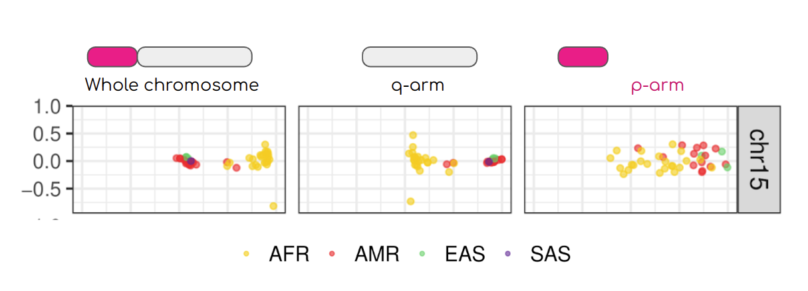

## Population differentiation using pca 
_(or lack of it on the short arms of acrocentric chromosoems)_



#### Before starting: f o r m a t t i n g 

Understanding and dealing with formatting issues sometimes take more time than runnig the analyses! The VCF we are using contains repeated variant IDs. As en example if you grep for `>77497>77500`  you will find three lines corresponding to three different genomic location for which the variant ID is the same. 

```shell
chm13#chr15     68355   >77497>77500    A       T
chm13#chr15     74647   >77497>77500    A       T
chm13#chr15     80963   >77497>77500    T       A
```
This is **a pangenome issue** because the VCF format was not conceived to represent all the information contained in a pangenome graphs.
This presents a challenge **specific to pangenomes** as the VCF (Variant Call Format) was not originally designed to fully represent the comprehensive information that pangenome graphs contain. In this case `>77497>77500`  representa  chunk of the genome containing multiple nested variants.  

Some of the plink (and other software) functions require unique IDs, therefore with the `--set-all-var-ids` we will convert variant IDs in the format that make them unique. We thus will recode the variant ID before proceding to pca analysis, so that they will look like this: 

```shell
chm13#chr15     68355   chm13#chr15:68355    A       T
chm13#chr15     74647   chm13#chr15:74647    A       T
chm13#chr15     80963   chm13#chr15:80963    T       A
```

To do this we will use plink and produce a new vcf using the option `--export`  and applying the `--set-all-var-ids`: 

```shell
plink2 --pfile ../data/chr15 \
       --allow-extra-chr \
       --snps-only \
       --set-all-var-ids @:#$r$a  \
       --export vcf \
       --out chr15uniqID


## --set-all-var-ids <template string>  deal with the annoying problem of having repeated variant ID in the VCF file see explanation below this box. Look at the [manual](https://www.cog-genomics.org/plink/2.0/data#set_all_var_ids) for a full expanation or at the box below for a quick one. 

## --out  name of the new vcf with the variant ID changed to be uniq note that we do not need to specify file extension 
```

Open the `chr15uniqID.vcf` and look at the new variant ID. Next step is to gzip the vcf and produce teh vcf index: 

```shell
bgzip chr15uniqID.vcf 
tabix -p vcf  chr15uniqID.vcf.gz
```

## PCA for the entire chromosome

If you did not have enough time to refromat the vcf you can use this one already formatted: 


#### a. Allele frequencies: 
Allele frequncies where the varinat ID will be corrected:

```shell
plink2 --vcf ../data/chr15uniqID.vcf.gz \
       --allow-extra-chr \
       --vcf-half-call m \
       --snps-only \
       --freq \
       --out chr15uniqID 
```

This will produce: 
```shell
-rw-rw-r-- 1 enza enza 36451525 gen 15 15:30 chr15uniqID.afreq
```

#### b. Remove GRC-hg38 
The sample named `grch38` correspond to the sequence of GRC-hg38. Because of the different sequencing methods adopted, `grch38` does not contain as much information as the other samples, therefore we will exclude it from the analysis. To do so we create a file that contain a list of individuals to be removed. This list will actually contain only `grch38`  and therefore be of length 1: 

```shell
echo grch38 > samplestoremove.list

``` 

#### c. PCA 
Finally! 

```shell 
plink2 --vcf chr15uniqID.vcf.gz \
       --allow-extra-chr \
       --vcf-half-call m \
       --snps-only \
       --remove samplestoremove.list \
       --read-freq chr15uniqID.afreq \
       --pca \
       --out all 
```


https://github.com/pangenome/chromosome_communities/blob/main/data/chm13.centromeres.approximate.bed

centromere coordinated for chr 15 are chr15	15,412,039	17,709,803

(base) enza@iusato:~/ezcngit/popgen/data$ zcat chr15uniqID.vcf.gz | grep -v '##' | cut -f1,2  | head -2 
#CHROM  POS
chm13#chr15     410
(base) enza@iusato:~/ezcngit/popgen/data$ zcat chr15uniqID.vcf.gz | grep -v '##' | cut -f1,2  | tail  -2 
chm13#chr15     99753036
chm13#chr15     99753074

```shell 
bcftools view -O z  -o p-arm.vcf.gz chr15uniqID.vcf.gz  -r chm13#chr15:0-15412039 
tabix -p vcf p-arm.vcf.gz

bcftools view -O z  -o q-arm.vcf.gz chr15uniqID.vcf.gz  -r chm13#chr15:17709803-99753074 
tabix -p vcf q-arm.vcf.gz


plink2 --vcf p-arm.vcf.gz \
       --allow-extra-chr \
       --vcf-half-call m \
       --snps-only \
       --remove samplestoremove.list \
       --read-freq chr15uniqID.afreq \
       --rm-dup exclude-mismatch \
       --pca \
       --out p-arm

plink2 --vcf q-arm.vcf.gz \
       --allow-extra-chr \
       --vcf-half-call m \
       --snps-only \
       --remove samplestoremove.list \
       --read-freq chr15uniqID.afreq \
       --pca \
       --out q-arm
```


```
for ass in chm13 hg38; do for c in $(seq 1 22); do 
plink2 --vcf chr$c.confident.SNPs.noRef.recode.vcf.gz\
--double-id \
--set-all-var-ids @:#$r:$a \
--rm-dup exclude-mismatch \
--vcf-half-call m \
--maf 0.01 \
--freq \
--out chr$c.confident.SNPs | \
plink2 --vcf chr$c.confident.SNPs.noRef.recode.vcf.gz \
--double-id \
--set-all-var-ids @:#$r:$a \
--rm-dup exclude-mismatch \
--vcf-half-call m \
--make-bed \
--read-freq chr$c.confident.SNPs.afreq \
--pca \
--out chr$c.confident.SNPs ; done
```
#### 7. Extract variants on p arm
```
for c in $(seq 1 22); do 
bcftools view -R chr$c.chm13.pArm_coord.txt \
-O z \
-o chr$c.confident.SNPs.pArm.vcf.gz chr$c.confident.SNPs.noRef.recode.vcf.gz | \
tabix -p vcf chr$c.confident.SNPs.pArm.vcf.gz; done
```
#### 8. Extract variants on q arm
```
for ass in chm13 hg38; do for c in $(seq 1 22); do
bcftools view -R chr$c.chm13.qArm_coord.txt \
-O z \
-o chr$c.confident.SNPs.qArm.vcf.gz \
chr$c.confident.SNPs.noRef.recode.vcf.gz | \
tabix -p vcf chr$c.confident.SNPs.qArm.vcf.gz; done
```
#### 9. PCA using variants on p and q arms

#### 10. Cluster analysis and plot
```
Rscript scr/clusterAnalysis.R \
pathToImputFiles \
length \
assembly \
method \
pathToOutputFile


Rscript scr/plotClustersHprc.R \
pathToImputFiles \
pathToPlot
```

#### 11. PCA plot
```
## put together eigenvec files
python3 scr/appendEigenvec.py \
-i "pathToImputFiles" \
-met method \
-ass assembly \
-len lehgth \
-o pathToOutputFile

Rscript scr/PCA_plot.R "pathToImputFiles" \
met \
pathToOtputPlot
``` 